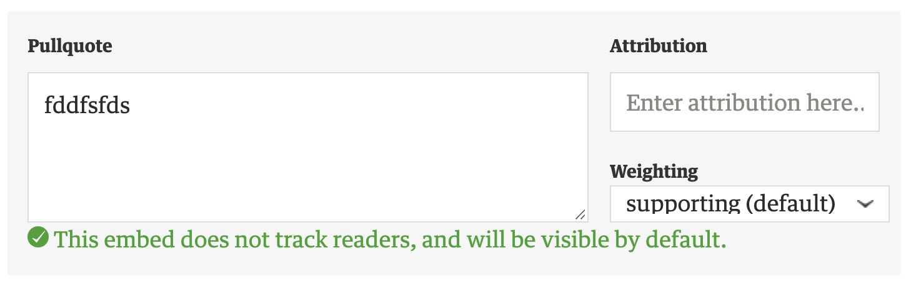
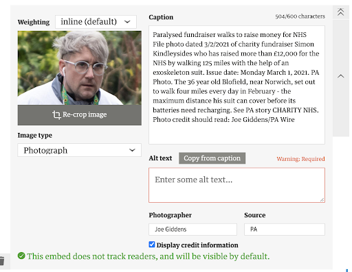

# ADR: Modelling fields as node content
## Context

At the Guardian, elements currently exist as block-level elements within a document. They manage an arbitrary amount of state that ranges from relatively simple (e.g. pullquote – one non-rich text field, a few supporting properties) to more complex (e.g. image – many rich text fields, communication with outside code for [Grid](https://github.com/guardian/grid) integration, etc.)

Elements are responsible for managing their own state and update their parent ProseMirror instance when changes occur. At the moment, elements model their state as fields within the attributes on their Prosemirror node. These attributes can contain arbitrary data – but they’re flat properties of that node, and we can only update these properties by replacing their parent object wholesale.

This works fine for most cases in a single editor, but becomes more problematic when collaborative editing is introduced. Because we replace node properties wholesale, any edits made to these elements in a collaborative context will be last-write-wins. In addition, we won’t be able to see cursor positions whilst other users are editing elements, and we won’t be able to see any decorations that the parent node might want to add (like noting, for example, or [Typerighter](https://github.com/guardian/typerighter) annotations).

To enable these things, we’ll need to model element properties in a way that more closely matches the document structure – treating, for example, rich text fields as document nodes, rather than flat attributes.

## Options

### 1. Leave things as they are

We decide that last-write-wins, and the lack of Typerighter in elements, is ‘good enough’, and don’t do any extra work.

### 2. Model all rich text fields as contiguous child nodes, rendered with `contentDOM`

We model element attributes that require text-editor semantics as child nodes within the prosemirror-schema. We can dynamically generate node types for each attribute we’d like to manage, and append them to the document schema.

Prosemirror then provides an API for our element, [contentDOM](https://prosemirror.net/docs/ref/#view.NodeView.contentDOM), which will take responsibility for rendering the node’s children and handling updates to the content.

There is an issue with this approach, it limits us to only displaying RTE fields next to each other. This could present issues with various element types with different layout requirements. It should be possible to restrict the marks that apply to these element-specific nodes [via the NodeSpec](https://prosemirror.net/docs/ref/#model.NodeSpec.marks).

### 3. Model all text fields as child nodes with nested editors

As with the previous option, we could model the element text-editor fields as child nodes within the prosemirror-schema and then pass them into separate NodeViews. RTE fields could then be handled as ProseMirror instances. The schema of these child instances would then need to be an appropriate subset of the parent instance.

The parent and child ProseMirror instances would need to be kept in sync, with transactions and document decorations being mapped and passed correctly between. Other events need to be correctly passed to the parent instance, such as undo and redo. This is more complex than having a single instance of ProseMirror responsible for modeling and rendering.

This is the approach [recommended](https://discuss.prosemirror.net/t/nodeviews-with-nested-first-class-rich-text-fields/3525) by the ProseMirror team and is similar to an example [footnote implementation](https://prosemirror.net/examples/footnote/) they provide with their documentation. 

This approach assumes that we’re modelling non-text fields as a collection of attributes on the parent node. This means that we’d still have last-write-wins semantics on the entire collection of non-text fields for each element – if two unrelated fields within the same element are changed concurrently, only one change will be persisted. This may be confusing to users, and lead to lost work or unexpected behaviour.

### 4. Model every property as a child node

As with option 3, but with all fields modeled within the scheme (no flat attributes), rendered as separate NodeViews. This would allow us to facilitate collaborative editing on all element fields and not just rich text, eliminating the problem with last-write-wins for non-text fields.

Care would have to be taken to ensure that the content we were adding to these nodes corresponded to the data type. For example, what does modelling a boolean value, or an array, look like within these nodes? It may be best to store these values as attributes on their nodes, rather than modelling them as text.

## Decision

We’d like to pursue options 3 or 4. Which we choose depends on how impactful we think last-write-wins is for non-text attributes, and the complexity of the implementation it requires – but option 4 is likely to have the least confusing behaviour for users.

## Consequences

- We’ll need more engineering time to implement the more complex solutions.
- We should take care to keep the complexity of the consumer API as low as possible, which will need to provide additional options to e.g. manage schema settings.

