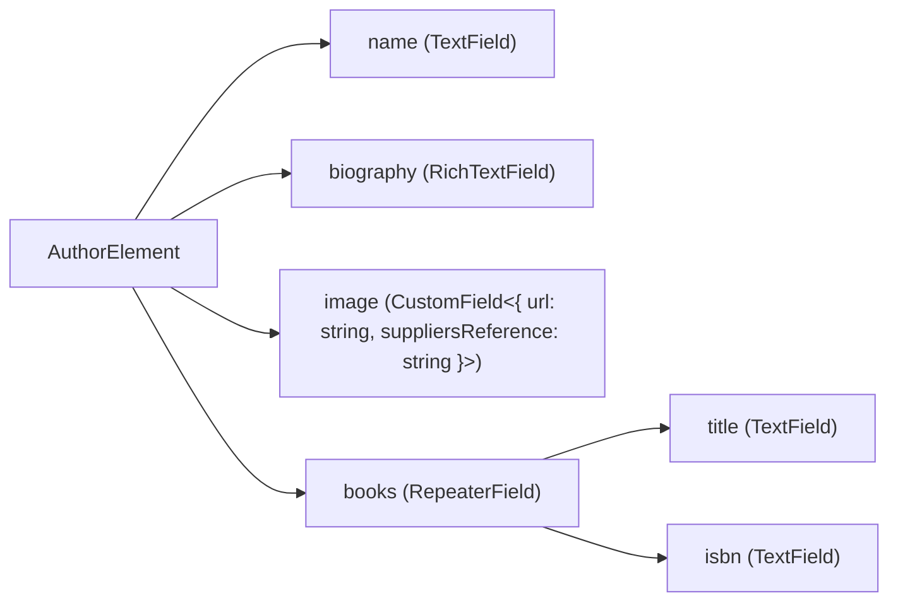
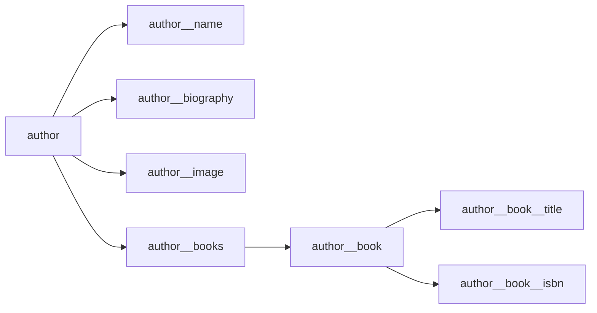

# How prosemirror-elements works

> NB: This document must reference many core ProseMirror concepts. There's a great guide to the core functionality of ProseMirror, written by the library author, [here.](https://prosemirror.net/docs/guide/#schema.content_expressions)

Let's suppose we'd like to represent the following data structure in prosemirror-elements.

```javascript
{
    name: "Bill Adler, Jr.",
    biography: "Bill Adler, Jr. is the author of over a dozen books. He lives in Washington, D.C., with his wife and two children.",
    image: {
      url: "https://images.bookstore.ipgbook.com/images/author_image_1/large/183766.jpg",
      suppliersReference: "SSB7275",
    }
    books: [{
        title: "Outwitting Squirrels",
        isbn: "9781569764800, 1569764808"
    }, {
        title: "The Weather Sourcebook",
        isbn: "9780762700806, 0762700807"
    }]
}
```

Our element definition and the plugin we add to our prosemirror editor might look like:

```typescript
const authorFields = {
    name: createTextField(),
    biography: createRichTextField(),
    image: createCustomField<{
      url: string,
      suppliersReference: string
    }>(),
    books: createRepeaterField({
      title: createTextField(),
      isbn: createTextField()
    })
}

const authorElement = createReactElementSpec(authorFields, ({ fields }) => {
  return /* define a Book React element here */
})

const { 
  nodeSpec,
  plugin,
  insertElement,
  getElementDataFromNode,
  getNodeFromElementData
} = buildElementPlugin({
  author: authorElement
});
```

We can see that the output of `buildElementPlugin` provides us with a few things:

1. A [NodeSpec](https://prosemirror.net/docs/ref/#model.NodeSpec), which defines the additional [Nodes](https://prosemirror.net/docs/ref/#model.Node) required to represent element data in Prosemirror. It must be added to the schema used by the consuming EditorView, which represents an editor instance.
2. A [Plugin](https://prosemirror.net/docs/ref/#state.Plugin), which can be added to a EditorView to enable Element support.
3. `insertElement`, which receives a plain Javascript object, converts it into a ProseMirror Node, and inserts it at the current selection head.
4. `getElementDataFromNode` and `getNodeFromElementData`, which translate a plain Javascript object into a Node, and vice-versa.

Let's go through the work prosemirror-elements must do to enable this functionality.

### Creating the NodeSpec

The field definitions could be represented in a graph as:



prosemirror-elements creates an ordered map of `NodeSpec` objects that represent this heirarchy:



Each `NodeSpec` also includes the correct [content expression](https://prosemirror.net/docs/guide/#schema.content_expressions) to ensure the integrity of the document. 

For example, the `author` content expression would look like `"author__name author_biography author__books"`, as the `author` node must have one of each of those nodes, in that order. 

The `author__books` content expression, however, would be `"author__book*"` – as a repeater field, `author__books` can contain 0-many `author__book` nodes.

Finally, leaf nodes must represent user data in some way. There are two main ways of storing data in a ProseMirror Node:
  - As node content. This is used whenever we want to express content types that are native to ProseMirror – for example, rich or plain text. The content expressions described above describe what sort of content a Node can contain. Data represented this way can be treated as part of the Prosemirror document – [`Selections`](https://prosemirror.net/docs/ref/#state.Selection) and [`Decorations`](https://prosemirror.net/docs/ref/#view.Decoration), for example, will work as expected, and updates to this content can be incremental, which is important for collaborative editing.
  - As arbitrary data, stored on the Node's `attrs` object as [`Attributes`](https://prosemirror.net/docs/ref/#model.NodeSpec.attrs). This is easy to implement, but means the data will be opaque to ProseMirror, and updates to the data always replace everything at once. This means that updates in a collaborative context, for example, will always be last-write-wins.

With this in mind, we can see that each field in our defining object maps to a NodeSpec with its own content expression:

```javascript
const authorElement = {
    name: createTextField(), // "text"
    biography: createRichTextField(), // "block+"
    image: createCustomField<{ url: string, suppliersReference: string }>(), // "" (data stored as attributes, not content)
    books: createRepeaterField({ // "author__books", and a child with "author__book*"
      title: createTextField(), // "text"
      isbn: createTextField() // "text"
    })
}
```

Once the `NodeSpec` is created and added to the editor schema, our ProseMirror editor can contain `Nodes` representing our element data. Now we must provide a way of translating plain data to `Nodes`, and vice-versa.

### Moving element data in and out of ProseMirror

### Representing Element data and its lifecycle within ProseMirror
